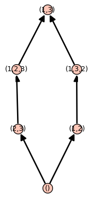
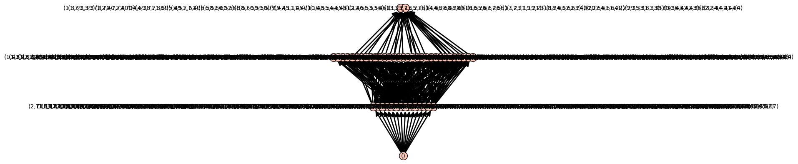

.. -*- coding: utf-8 -*-
.. _demo-reflection-groups:

===============================
Demo: reflection groups (draft)
===============================

.. MODULEAUTHOR:: Nicolas M. Thiéry, Vic Reiner, ...

`\def\QQ{\mathbb{Q}}\def\CC{\mathbb{C}}\def\Hilb{\operatorname{Hilb}}`

This demonstration review some of the features of Coxeter and
reflection groups (basic manipulations, related posets, calculation of
Molien type series). It grew out of a live demo improvised with the
participants during interactive sessions at the CRM workshop on
reflection groups on May 29th of 2017.

.. TOPIC:: Requirements

    This demonstration requires
    `gap3 <http://doc.sagemath.org/html/en/reference/interfaces/sage/interfaces/gap3.html>`_
    to be installed.

.. linkall

::

    sage: %display latex                      # not tested

Constructing Coxeter groups
===========================

Let's build the Coxeter group of *type* `E_8`, and do some sample
calculations with it::

    sage: W = CoxeterGroup(["E",8])
    sage: W
    Finite Coxeter group over Integer Ring with Coxeter matrix:
    [1 2 3 2 2 2 2 2]
    [2 1 2 3 2 2 2 2]
    [3 2 1 3 2 2 2 2]
    [2 3 3 1 3 2 2 2]
    [2 2 2 3 1 3 2 2]
    [2 2 2 2 3 1 3 2]
    [2 2 2 2 2 3 1 3]
    [2 2 2 2 2 2 3 1]
    sage: W.cardinality()
    696729600

By default, this Coxeter group is constructed as a matrix group::

    sage: W.an_element()
    [ 0  1  0  0  0  0  0 -1]
    [ 0  0  1  0  0  0  0 -1]
    [ 1  1  0  0  0  0  0 -1]
    [ 0  1  1  0  0  0  0 -1]
    [ 0  0  0  1  0  0  0 -1]
    [ 0  0  0  0  1  0  0 -1]
    [ 0  0  0  0  0  1  0 -1]
    [ 0  0  0  0  0  0  1 -1]

Instead, it's possible to construct it as a permutation group, namely
the group of permutation of its roots::

    sage: W = CoxeterGroup(["E",8], implementation="permutation")
    sage: w = W.an_element(); w
    (1,121)(3,13)(9,22)(18,27)(19,23)(25,30)(29,35)(31,42)(34,40)(36,37)(38,45)(41,47)(43,49)(44,56)(48,51)(50,52)(54,59)(55,62)(57,64)(60,63)(68,73)(74,78)(96,98)(100,102)(101,106)(104,107)(108,110)(109,112)(111,113)(123,133)(129,142)(138,147)(139,143)(145,150)(149,155)(151,162)(154,160)(156,157)(158,165)(161,167)(163,169)(164,176)(168,171)(170,172)(174,179)(175,182)(177,184)(180,183)(188,193)(194,198)(216,218)(220,222)(221,226)(224,227)(228,230)(229,232)(231,233)

Finite and affine Coxeter groups can be specified as above using their
classification, by providing their *Cartan type*. Here is a sample of
all available Cartan types::

    sage: CartanType.samples()
    [['A', 1], ['A', 5], ['B', 1], ['B', 5], ['C', 1], ['C', 5],
     ['D', 2], ['D', 3], ['D', 5],
     ['E', 6], ['E', 7], ['E', 8],
     ['F', 4], ['G', 2], ['I', 5], ['H', 3], ['H', 4],
     ['A', 1, 1], ... ['BC', 5, 2]^*]

It contains all exceptional types, and a couple representatives of
each infinite families.

Reduced words
=============

Let's play with elements and reduced words. One can construct an
element from the Coxeter generators (also called simple reflections)
with::

    sage: s = W.simple_reflections()
    sage: w = s[1] * s[3] * s[2]; w
    (1,133,3)(2,122)(4,18,22,10,9,27)(13,123,121)(15,25,23,21,19,30)(17,36,35,28,29,37)(26,41,42,33,31,47)(32,48,45,39,38,51)(34,46,40)(43,53,49)(44,61,56)(50,58,52)(54,67,59)(55,66,62)(57,69,64)(60,70,63)(65,72)(68,77,73)(71,75)(74,83,78)(76,84)(79,81)(80,87)(82,88)(85,91)(86,90)(89,96,98)(92,94)(93,100,102)(95,99)(97,101,106)(103,104,107)(105,108,110)(109,115,112,111,114,113)(124,138,142,130,129,147)(135,145,143,141,139,150)(137,156,155,148,149,157)(146,161,162,153,151,167)(152,168,165,159,158,171)(154,166,160)(163,173,169)(164,181,176)(170,178,172)(174,187,179)(175,186,182)(177,189,184)(180,190,183)(185,192)(188,197,193)(191,195)(194,203,198)(196,204)(199,201)(200,207)(202,208)(205,211)(206,210)(209,216,218)(212,214)(213,220,222)(215,219)(217,221,226)(223,224,227)(225,228,230)(229,235,232,231,234,233)

Here is a short hand (note: the word need not be reduced)::

    sage: W.from_reduced_word([1,3,2])
    (1,133,3)(2,122)(4,18,22,10,9,27)(13,123,121)(15,25,23,21,19,30)(17,36,35,28,29,37)(26,41,42,33,31,47)(32,48,45,39,38,51)(34,46,40)(43,53,49)(44,61,56)(50,58,52)(54,67,59)(55,66,62)(57,69,64)(60,70,63)(65,72)(68,77,73)(71,75)(74,83,78)(76,84)(79,81)(80,87)(82,88)(85,91)(86,90)(89,96,98)(92,94)(93,100,102)(95,99)(97,101,106)(103,104,107)(105,108,110)(109,115,112,111,114,113)(124,138,142,130,129,147)(135,145,143,141,139,150)(137,156,155,148,149,157)(146,161,162,153,151,167)(152,168,165,159,158,171)(154,166,160)(163,173,169)(164,181,176)(170,178,172)(174,187,179)(175,186,182)(177,189,184)(180,190,183)(185,192)(188,197,193)(191,195)(194,203,198)(196,204)(199,201)(200,207)(202,208)(205,211)(206,210)(209,216,218)(212,214)(213,220,222)(215,219)(217,221,226)(223,224,227)(225,228,230)(229,235,232,231,234,233)

    sage: w.reduced_word()
    [1, 2, 3]
    sage: w.reduced_words()
    [[1, 3, 2], [2, 1, 3], [1, 2, 3]]

Posets related to Reflection groups
===================================

The symmetric group is endowed with it's Coxeter (in fact Weyl) group structure::

    sage: W = SymmetricGroup(3)
    sage: print(W.category())
    Join of Category of finite enumerated permutation groups and Category of finite weyl groups

Some computations with the weak order::

    sage: P = W.weak_lattice()
    sage: P.plot()
    Graphics object consisting of 13 graphics primitives

::

    sage: s = W.simple_reflections()
    sage: P.le( s[1], s[2]*s[1])
    False

    sage: P.join(s[1], s[2]*s[1])
    (1,3)

and with the absolute poset of a reflection group::

    sage: W = ReflectionGroup(6)
    sage: P = W.absolute_poset();
    sage: P.plot()
    Graphics object consisting of 265 graphics primitives

.. _demo-reflection-groups-molien:

Computing Molien-type sums for reflection groups
================================================

Let's start by exploring the Shephard-Todd reflection group ``G_4``::

    sage: W = ReflectionGroup(4); W
    Irreducible complex reflection group of rank 2 and type ST4

    sage: W.cardinality()
    24

    sage: W.is_isomorphic(SymmetricGroup(4))
    False

It is constructed as a permutation group::

    sage: w = W.an_element(); w
    (1,3,9)(2,4,7)(5,10,18)(6,11,16)(8,12,19)(13,15,20)(14,17,21)(22,23,24)

Here is how to recover the matrix action on `V` and `V^*`::

    sage: m = w.to_matrix(); m
    [   1    0]
    [   0 E(3)]

    sage: w.to_matrix("dual")
    [     1      0]
    [     0 E(3)^2]

The Hilbert series of the invariant ring and degrees of its generators
======================================================================

Let's use Molien's formula to compute the Hilbert series
`H=\Hilb(\CC[V]^W,q)` of the invariant ring `\CC[V]^W=S(V^*)^W`::

    sage: QQq = QQ['q'].fraction_field()
    sage: q = QQq.gen()

    sage: H = 1/W.cardinality() * sum(   1/det(1-q*w.to_matrix()) for w in W );
    sage: H
    1/(q^10 - q^6 - q^4 + 1)

We know that this should factor as `\frac{1}{\prod 1-q^{d_i}}`.

Frustrating as it is, Sage can't factor the above fraction as is::

    sage: H.factor()
    Traceback (most recent call last):
    ...
    NotImplementedError

That's because it *looks* like a fraction in `\QQ(q)` but it is
in fact a fraction in the Universal Cyclotomic Field (the extension of
`\QQ` containing all roots of unity)::

    sage: H.parent()
    Fraction Field of Univariate Polynomial Ring in q over Universal Cyclotomic Field

To proceed, we first convert `H` into `\QQ(q)`::

    sage: H = QQq(H)
    sage: H.parent()
    Fraction Field of Univariate Polynomial Ring in q over Rational Field

and then can finally factor it::

    sage: factor(H.denominator())
    (q - 1)^2 * (q + 1)^2 * (q^2 - q + 1) * (q^2 + 1) * (q^2 + q + 1)

This is a product of cyclotomic polynomials, and by manual inspection,
one we can recover the desired form for the denominator of `H`::

    sage: H.denominator() == (1-q^4)*(1-q^6)
    True

This is telling us that the invariant ring is generated by two
invariants of degree `4` and `6`. Let's double check this.

Sage can compute generators of an invariant ring of a finite matrix
group, but only over reasonably simple fields, which does not include
the Universal Cyclotomic Field. So we are going to convert our group
into a matrix group ``WM`` over the Cyclotomic Field of degree `3`::

    sage: K = CyclotomicField(3)
    sage: WM = MatrixGroup( [ matrix(K, w.to_matrix()) for w in W.gens()])
    sage: WM
    Matrix group over Cyclotomic Field of order 3 and degree 2 with 2 generators (
    [    1     0]  [2/3*zeta3 + 1/3 1/3*zeta3 - 1/3]
    [    0 zeta3], [2/3*zeta3 - 2/3 1/3*zeta3 + 2/3]
    )

    sage: WM.invariant_generators()
    [x1^4 - x1*x2^3, x1^6 + 5/2*x1^3*x2^3 - 1/8*x2^6]

Computation of exponents and coexponents
----------------------------------------

We will use that `V` and `V^*` are irreducible
representations together with the following relations between the
Hilbert series of the corresponding isotypic components in the
polynomial ring `\CC[V]^W` with the exponents
`e_1,\ldots,e_n` and coexponents `e_1^*,\ldots,e_n^*`:

.. math:: \frac{1}{|W|} \sum_{w\in W} \frac{\chi_V(w)}{\det(1-qw)} =  \Hilb(\CC[V]^W,q) \quad ( q^{e_1} + \cdots + q^{e_n})

.. math:: \frac{1}{|W|} \sum_{w\in W} \frac{\chi_V^*(w)}{\det(1-qw)} =  \Hilb(\CC[V]^W,q) \quad ( q^{e_1^*} + \cdots + q^{e_n^*})

::

    sage: 1/W.cardinality() * sum( w.to_matrix().trace()/det(1-q*w.to_matrix()) for w in W   ) / H
    q^5 + q^3

    sage: 1/W.cardinality() * sum( w.to_matrix("dual").trace()/det(1-q*w.to_matrix()) for w in W   ) / H
    q^3 + q

Let's do a consistency check with the degrees (which are the `e_i+1`)
and the codegrees (which are the `e_i^*-1`)::

    sage: W.degrees()
    (4, 6)
    sage: W.codegrees()
    (2, 0)

Solomon's formula
=================

.. TOPIC:: Exercise

    Compute the Hilbert series of `(\CC[V]\otimes \bigwedge^\cdot V^*)^W`
    via a Molien-type calculation:

    .. math:: \Hilb((\CC[V]\otimes \bigwedge^\cdot V^*)^W,q,t) = \frac{1}{|W|} \sum_{w\in W} \frac{\det(1+tw)}{\det(1-qw)}

    and then compare it to the prediction of Solomon's formula, namely:

    .. math:: \Hilb((\CC[V]\otimes \bigwedge^\cdot V^*)^W,q,t) = \frac{\prod_{i=1}^n ( 1 + q^{e_i}t )}{\prod_{i=1}^n (1 - q^{d_i} )}

.. TOPIC:: Solution

    ::

        sage: QQqt = QQ['q,t'].fraction_field()
        sage: q,t = QQqt.gens()
        sage: Solomon = 1/W.cardinality() * sum( det(1+t*w.to_matrix()) / det(1-q*w.to_matrix()) for w in W   )
        sage: QQqt(Solomon) / H
        q^8*t^2 + q^5*t + q^3*t + 1
        sage: _.factor()
        (q^3*t + 1) * (q^5*t + 1)
