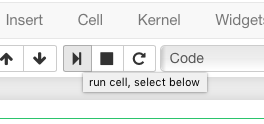

.. _tutorial-start-here:

===========
Start here!
===========

About SageMath and this document
================================

`SageMath <https://www.sagemath.org>`_ (``Sage`` for short) is a general
purpose computational mathematics system developed by a worldwide
community of hundreds of researchers, teachers and engineers. It's
based on the Python programming language and includes GAP, PARI/GP,
Singular, and dozens of other specialized libraries.

This live document will guide you through the first steps of using
Sage, and provide pointers to explore and learn further.

In the following, we will be assuming that you are reading this
document as a Jupyter notebook (Jupyter is the primary user interface
for Sage). If instead you are reading this document as a web page, you can click
on ``Run on mybinder.org`` to get access to the notebook online. If
you have Sage already installed on your machine, you may instead
download this page ``As Jupyter notebook``. If you just want to try
out a few things, you may also just click the ``Activate`` button on
the upper right corner to play with the examples.

.. TODO::

    - credits on the many sources of inspiration

Entering, editing, and evaluating input
=======================================

A first calculation
-------------------

Sage can be used as a pocket calculator: you type in some expression
to be calculated, Sage evaluates it, and prints the result; and
repeat. This is called the *Read-Eval-Print-Loop*. In the Jupyter
notebook, you type the expression in an **input cell**, or **code
cell**. This is the rectangle below this paragraph containing `1+1`
(if instead you see ``sage: 1+1``, you are reading this document as a
web page and won't be able to play with the examples). Click on the
cell to select it, and press ``shift-enter`` to evaluate it::
    sage: 1 + 1
    2

You may instead click the play button in the tool bar or use the
``Cell`` menu:

Sage prints out its response in an **output cell** just below the
input cell (that's the ``2``, so Sage confirms that :math:`1+1=2`).
Click again in the cell, replace `1+1` by `2+2`,
and evaluate it. Notice how much quicker it is now? That's because a
Sage process had to be started the first time, and then stayed ready.

Congratulations, you have done your first calculations with ``Sage``.

Using the Jupyter Notebook
--------------------------

Now take some time to explore the ``Help`` menu. We specifically
recommend taking the ``User Interface Tour``, and coming back to
``Keyboard shortcuts`` every now and then to get fast at Jupyter.
The Jupyter developers also maintain a `tutorial notebook
<https://nbviewer.jupyter.org/github/ipython/ipython/blob/3.x/examples/Notebook/Index.ipynb>`_
which you may find useful.

For now we just review the basics. Use the menu item ``Insert ->
Insert Cell Below`` to create a new input cell below this paragraph,
then calculate any simple expression of your liking.

You can move around and edit any cell by clicking in it. Go back and change
your `2+2` above to `3+3` and re-evaluate it.

You can also edit any **text cell** by double clicking on it. Try it
now! The text you see is using the
`Markdown
<https://jupyter-notebook.readthedocs.io/en/latest/examples/Notebook/Working%20With%20Markdown%20Cells.html>`_
markup language. Do some changes to the text, and evaluate it again to
rerender it.
Markdown supports a fair amount of basic formatting,
such as bold, underline, basic lists, and so forth.
Thanks to the TeX rendering engine
`MathJax <https://www.mathjax.org/>`_, you may
embed mathematical formulae such as $\sin(x) - y^3$ just like with LaTeX.
It can be fun to type in fairly complicated math, like this:

.. MATH::

   \zeta(s)=\sum_{n=1}^{\infty}\frac{1}{n^s}=\prod_p \left(\frac{1}{1-p^{-s}}\right)

If you *mess everything up*, you can use the menu ``Kernel ->
Restart`` to restart Sage. You can also use the menu ``File -> Save and
Checkpoint`` to save notebook, and ``File -> Revert to Checkpoint -> ...``
to reset to any previously saved version.

More interactions
-----------------

We are now done with basic interaction with Sage. Much richer
interactions are possible thanks to Jupyter's *interactive widgets*.
That will be the topic for a later tutorial; here is just a teaser for
now. Try clicking on the sliders to illustrate multiplication below.
Also, you can try changing the slider ranges to something different by
editing the input cell (make sure to also change ``xmax``, ``ymax``)::

    sage: @interact                                # not tested
    ....: def f(n=(1 .. 15), m=(1 .. 15)):
    ....:     print("n * m = {} = {}".format(n * m, factor(n * m)))
    ....:     P = polygon([(0, 0), (0, n), (m, n), (m, 0)])
    ....:     P.show(aspect_ratio=1, gridlines='minor', figsize=[3, 3], xmax=14, ymax=14)

A brief tour
============

Sage covers many areas of mathematics:

**2D/3D Graphics**, **Categories**, **Basic Rings and Fields**: Integers
and Rational Numbers, Real and Complex Numbers, Finite Rings and Fields,
Polynomials, Formal Power Series, p-Adic Numbers, Quaternion Algebras,
**Linear Algebra**: Matrices and Spaces of Matrices, Vectors and
Modules, Tensors on Free Modules of Finite Rank, **Calculus and
Analysis**: Symbolic Calculus, Mathematical Constants, Elementary and
Special Functions, Asymptotic Expansions, Numerical Optimization,
**Probability and Statistics**, Probability , Statistics, Quantitative
Finance, **Mathematical Structures**: Sets, Monoids, Groups, Semirings,
Rings, Algebras, **Discrete Mathematics** Combinatorics, Graph Theory,
Quivers, Matroid Theory, Discrete Dynamics, Coding Theory, Cryptography,
Game Theory, Symbolic Logic, SAT solvers, **Geometry and Topology**:
Combinatorial and Discrete Geometry, Hyperbolic Geometry, Cell Complexes
and their Homology, Differential Forms, Manifolds, Parametrized
Surfaces, Knot Theory, **Number Fields and Function Fields**, **Number
Theory**: Diophantine approximation, Quadratic Forms, L-Functions,
Arithmetic Subgroups of :math:`SL_2(Z)`, General Hecke Algebras and
Hecke Modules, Modular Symbols, Modular Forms, Modular Forms for Hecke
Triangle Groups, Modular Abelian Varieties, **Algebraic and Arithmetic
Geometry**: Schemes, Plane, Elliptic and Hyperelliptic Curves,
**Databases**, **Games**

We now engage in a brief tour.

.. TODO::

   - Better formatting of the above list of areas, with links to
     relevant pieces of the documentation.
   - Insert more striking examples
   - Insert Read More links

Calculus
--------

.. skip

::

    sage: %display latex

::

    sage: x,y = var('x,y')
    sage: f = (cos(pi/4-x)-tan(x)) / (1-sin(pi/4 + x)); f
    -(cos(1/4*pi - x) - tan(x))/(sin(1/4*pi + x) - 1)
    sage: limit(f, x = pi/4, dir='minus')
    +Infinity

    sage: solve([x^2+y^2 == 1, y^2 == x^3 + x + 1], x, y)
    [[x == -1/2*I*sqrt(3) - 1/2, y == -sqrt(-1/2*I*sqrt(3) + 3/2)],
     [x == -1/2*I*sqrt(3) - 1/2, y == sqrt(-1/2*I*sqrt(3) + 3/2)],
     [x == 1/2*I*sqrt(3) - 1/2, y == -sqrt(1/2*I*sqrt(3) + 3/2)],
     [x == 1/2*I*sqrt(3) - 1/2, y == sqrt(1/2*I*sqrt(3) + 3/2)],
     [x == 0, y == -1], [x == 0, y == 1]]

    sage: plot3d(sin(pi*sqrt(x^2+y^2)) / sqrt(x^2+y^2), (x,-5,5), (y,-5,5), viewer="threejs")
    Graphics3d Object

    sage: contour_plot(y^2 + 1 - x^3 - x, (x,-pi,pi), (y,-pi,pi),
    ....:              contours=[-8,-4,0,4,8], colorbar=True)
    Graphics object consisting of 1 graphics primitive

Algebra
-------

::

    sage: factor(x^100 - 1)
    (x^40 - x^30 + x^20 - x^10 + 1)*(x^20 + x^15 + x^10 + x^5 + 1)*(x^20 - x^15 + x^10 - x^5 + 1)*(x^8 - x^6 + x^4 - x^2 + 1)*(x^4 + x^3 + x^2 + x + 1)*(x^4 - x^3 + x^2 - x + 1)*(x^2 + 1)*(x + 1)*(x - 1)

    sage: p = 54*x^4+36*x^3-102*x^2-72*x-12
    sage: p.factor()
    6*(x^2 - 2)*(3*x + 1)^2

    sage: for K in [ZZ, QQ, ComplexField(16), QQ[sqrt(2)], GF(5)]:
    ....:     print(K, ":"); print(K['x'](p).factor())
    Integer Ring :
    2 * 3 * (3*x + 1)^2 * (x^2 - 2)
    Rational Field :
    (54) * (x + 1/3)^2 * (x^2 - 2)
    Complex Field with 16 bits of precision :
    (54.00) * (x - 1.414) * (x + 0.3333)^2 * (x + 1.414)
    Number Field in sqrt2 with defining polynomial x^2 - 2 :
    (54) * (x - sqrt2) * (x + sqrt2) * (x + 1/3)^2
    Finite Field of size 5 :
    (4) * (x + 2)^2 * (x^2 + 3)

    sage: ZZ.category()
    Join of Category of euclidean domains and Category of infinite enumerated sets and Category of metric spaces

    sage: sorted( ZZ.category().axioms() )
    ['AdditiveAssociative', 'AdditiveCommutative', 'AdditiveInverse', 'AdditiveUnital',
     'Associative', 'Commutative', 'Distributive',
     'Enumerated', 'Infinite',
     'NoZeroDivisors',
     'Unital']

Linear algebra
--------------

::

    sage: A = matrix(GF(7), 4, [5,5,4,3,0,3,3,4,0,1,5,4,6,0,6,3]); A
    [5 5 4 3]
    [0 3 3 4]
    [0 1 5 4]
    [6 0 6 3]

    sage: P = A.characteristic_polynomial(); P
    x^4 + 5*x^3 + 6*x + 2

    sage: P(A)
    [0 0 0 0]
    [0 0 0 0]
    [0 0 0 0]
    [0 0 0 0]

    sage: A.eigenspaces_left()
    [
    (4, Vector space of degree 4 and dimension 1 over Finite Field of size 7
    User basis matrix:
    [1 4 6 1]),
    (1, Vector space of degree 4 and dimension 1 over Finite Field of size 7
    User basis matrix:
    [1 3 3 4]),
    (2, Vector space of degree 4 and dimension 2 over Finite Field of size 7
    User basis matrix:
    [1 0 2 3]
    [0 1 6 0])
    ]

Computing the rank of a large sparse matrix::

    sage: M = random_matrix(GF(7), 10000, sparse=True, density=3/10000)
    sage: M.rank()                        # random
    9263

Geometry
--------

::

    sage: polytopes.truncated_icosidodecahedron().plot(viewer="threejs")
    Graphics3d Object

Programming and plotting
------------------------

::

    sage: n, l, x, y = 10000, 1, 0, 0
    sage: p = [[0, 0]]
    sage: for k in range(n):
    ....:     theta = (2 * pi * random()).n(digits=5)
    ....:     x, y = x + l * cos(theta), y + l * sin(theta)
    ....:     p.append([x, y])
    sage: g = line(p, thickness=.4) + line([p[n], [0, 0]], color='red', thickness=2)
    sage: g.show(aspect_ratio=1)

Interactive plots
-----------------

::

    sage: x = var('x')
    sage: @interact                                # not tested
    ....: def g(f=x*sin(1/x),
    ....:       c=slider(-1, 1, .01, default=-.5),
    ....:       n=(1..30),
    ....:       xinterval=range_slider(-1, 1, .1, default=(-8,8), label="x-interval"),
    ....:       yinterval=range_slider(-1, 1, .1, default=(-3,3), label="y-interval")):
    ....:     x0 = c
    ....:     degree = n
    ....:     xmin,xmax = xinterval
    ....:     ymin,ymax = yinterval
    ....:     p   = plot(f, xmin, xmax, thickness=4)
    ....:     dot = point((x0,f(x=x0)),pointsize=80,rgbcolor=(1,0,0))
    ....:     ft = f.taylor(x,x0,degree)
    ....:     pt = plot(ft, xmin, xmax, color='red', thickness=2, fill=f)
    ....:     show(dot + p + pt, ymin=ymin, ymax=ymax, xmin=xmin, xmax=xmax)
    ....:     html('$f(x)\;=\;%s$'%latex(f))
    ....:     html('$P_{%s}(x)\;=\;%s+R_{%s}(x)$'%(degree,latex(ft),degree))

Graph Theory
------------

Coloring graphs::

    sage: g = graphs.PetersenGraph(); g
    Petersen graph: Graph on 10 vertices
    sage: g.plot(partition=g.coloring())
    Graphics object consisting of 26 graphics primitives

Combinatorics
-------------

Fast counting::

    sage: Partitions(100000).cardinality()
    27493510569775696512677516320986352688173429315980054758203125984302147328114964173055050741660736621590157844774296248940493063070200461792764493033510116079342457190155718943509725312466108452006369558934464248716828789832182345009262853831404597021307130674510624419227311238999702284408609370935531629697851569569892196108480158600569421098519

Playing poker::

    sage: Suits   = Set(["Hearts", "Diamonds", "Spades", "Clubs"])
    sage: Values  = Set([2, 3, 4, 5, 6, 7, 8, 9, 10, "Jack", "Queen", "King", "Ace"])
    sage: Cards   = cartesian_product([Values, Suits])
    sage: Hands   = Subsets(Cards, 5)
    sage: Hands.random_element()                        # random
    {(5, 'Pique'), (4, 'Coeur'), (8, 'Trefle'), ('As', 'Trefle'), (10, 'Carreau')}
    sage: Hands.cardinality()
    2598960

Algebraic Combinatorics
-----------------------

Drawing an affine root systems::

    sage: L = RootSystem(["G", 2, 1]).ambient_space()
    sage: p = L.plot(affine=False, level=1)
    sage: p.show(aspect_ratio=[1, 1, 2], frame=False)

Number Theory
-------------

::

    sage: E = EllipticCurve('389a')
    sage: plot(E, thickness=3)
    Graphics object consisting of 2 graphics primitives

Games
-----

Sudoku solver::

    sage: S = Sudoku('5...8..49...5...3..673....115..........2.8..........187....415..3...2...49..5...3'); S
    +-----+-----+-----+
    |5    |  8  |  4 9|
    |     |5    |  3  |
    |  6 7|3    |    1|
    +-----+-----+-----+
    |1 5  |     |     |
    |     |2   8|     |
    |     |     |  1 8|
    +-----+-----+-----+
    |7    |    4|1 5  |
    |  3  |    2|     |
    |4 9  |  5  |    3|
    +-----+-----+-----+

    sage: list(S.solve())
    [+-----+-----+-----+
     |5 1 3|6 8 7|2 4 9|
     |8 4 9|5 2 1|6 3 7|
     |2 6 7|3 4 9|5 8 1|
     +-----+-----+-----+
     |1 5 8|4 6 3|9 7 2|
     |9 7 4|2 1 8|3 6 5|
     |3 2 6|7 9 5|4 1 8|
     +-----+-----+-----+
     |7 8 2|9 3 4|1 5 6|
     |6 3 5|1 7 2|8 9 4|
     |4 9 1|8 5 6|7 2 3|
     +-----+-----+-----+]

Help system
===========

We review the three main ways to get help in Sage:

- navigating through the documentation
- tab-completion,
- contextual help.

Navigating through the documentation
------------------------------------

The ``Help`` menu gives access to the HTML documentation for ``Sage``
(and other pieces of software). This includes the ``Sage`` tutorial,
the ``Sage`` thematic tutorials, and the ``Sage`` reference manual.
This documentation is also available online from ``Sage``'s web site
https://www.sagemath.org .

Completion and contextual documentation
---------------------------------------

Start typing something and press the ``Tab`` key. The interface tries to
complete it with a command name. If there is more than one completion, then
they are all presented to you. Remember that Sage is case sensitive, i.e. it
differentiates upper case from lower case. Hence the ``Tab`` completion of
``klein`` won't show you the ``KleinFourGroup`` command that builds the group
`\ZZ/2 \times \ZZ/2` as a permutation group. Try pressing the ``Tab``
key in the following cells:

.. skip

::

    sage: klein

    sage: Klein

To see documentation and examples for a command, type a question mark
``?`` at the end of the command name and evaluate the cell:

.. skip

::

    sage: KleinFourGroup?

.. skip

::

    sage:

.. TOPIC:: Exercise A

    What is the largest prime factor of `600851475143`?

    .. skip

    ::

        sage: factor?

    .. skip

    ::

        sage: 

Digression: assignments and methods
-----------------------------------

In the above manipulations we did not store any data for
later use. This can be done in Sage with the ``=`` symbol as in::

    sage: a = 3
    sage: b = 2
    sage: a + b
    5

This can be understood as Sage evaluating the expression to the right
of the ``=`` sign and creating the appropriate object, and then
associating that object with a label, given by the left-hand side (see
the foreword of :ref:`tutorial-objects-and-classes` for
details). Multiple assignments can be done at once::

    sage: a, b = 2, 3
    sage: a
    2
    sage: b
    3

This allows us to swap the values of two variables directly::

    sage: a, b = 2, 3
    sage: a, b = b, a
    sage: a, b
    (3, 2)

We can also assign a common value to several variables simultaneously::

    sage: c = d = 1
    sage: c, d
    (1, 1)
    sage: d = 2
    sage: c, d
    (1, 2)

Note that when we use the word *variable* in the computer-science sense we
mean "a label attached to some data stored by Sage". Once an object is
created, some *methods* apply to it. This means *functions* but instead of
writing **f(my_object)** you write **my_object.f()**::

    sage: p = 17
    sage: p.is_prime()
    True

See :ref:`tutorial-objects-and-classes` for details.

Method discovery with tab-completion
------------------------------------

.. TODO:: Replace the examples below by less specialized ones

To know all methods of an object you can once more use tab-completion.
Write the name of the object followed by a dot and then press ``Tab``:

.. skip

::

    sage: a.

.. TOPIC:: Exercise B

    Create the permutation 51324 and assign it to the variable ``p``.

    .. skip

    ::

        sage: Permutation?

    ::

        sage: 

    What is the ``inverse`` of ``p``?

    .. skip

    ::

        sage: p.inv

        sage: 

    Does ``p`` have the ``pattern`` 123? What about 1234? And 312? (even if you don't
    know what a pattern is, you should be able to find a command that does this).

    .. skip

    ::

        sage: p.pat

        sage: 

Exercises
=========

Linear algebra
--------------

.. TOPIC:: Exercise C

    Use the :func:`matrix` command to create the following matrix.

    .. MATH::

        M = \left(\begin{array}{rrrr}
        10 & 4 & 1 & 1 \\
        4 & 6 & 5 & 1 \\
        1 & 5 & 6 & 4 \\
        1 & 1 & 4 & 10
        \end{array}\right)

    .. skip

    ::

        sage: matrix?

    ::

        sage: 

    Then, using methods of the matrix,

    1. Compute the determinant of the matrix.
    2. Compute the echelon form of the matrix.
    3. Compute the eigenvalues of the matrix.
    4. Compute the kernel of the matrix.
    5. Compute the LLL decomposition of the matrix (and lookup the
       documentation for what LLL is if needed!)

    ::

        sage: 

        sage: 

    Now that you know how to access the different methods of matrices,

    6. Create the vector `v = (1, -1, -1, 1)`.
    7. Compute the two products: `M \cdot v` and `v \cdot M`. What mathematically
       borderline operation is Sage doing implicitly?

    .. skip

    ::

        sage: vector?

    ::

        sage: 

.. NOTE::

    Vectors in Sage can be used as row vectors or column vectors.
    A method such as ``eigenspaces`` might not
    return what you expect, so it is best to specify ``eigenspaces_left`` or
    ``eigenspaces_right`` instead. Same thing for kernel (``left_kernel`` or
    ``right_kernel``), and so on.

Plotting
--------

The :func:`plot` command allows you to draw plots of functions. Recall
that you can access the documentation by pressing the ``Tab`` key
after writing ``plot?`` in a cell:

.. skip

::

    sage: plot?

::

    sage: 

Here is a simple example::

    sage: var('x')   # make sure x is a symbolic variable
    x
    sage: plot(sin(x^2), (x, 0, 10))
    Graphics object consisting of 1 graphics primitive

Here is a more complicated plot. Try to change every single input to the plot
command in some way, evaluating to see what happens::

    sage: P = plot(sin(x^2), (x, -2, 2), rgbcolor=(0.8, 0, 0.2), thickness=3, linestyle='--', fill='axis')
    sage: show(P, gridlines=True)

Above we used the :func:`show` command to show a plot after it was created. You can
also use ``P.show`` instead::

    sage: P.show(gridlines=True)

Try putting the cursor right after ``P.show(`` and pressing ``Tab`` to get a list of
the options for how you can change the values of the given inputs.

.. skip

::

    sage: P.show(

Plotting multiple functions at once is as easy as adding the plots together::

    sage: P1 = plot(sin(x), (x, 0, 2*pi))
    sage: P2 = plot(cos(x), (x, 0, 2*pi), rgbcolor='red')
    sage: P1 + P2
    Graphics object consisting of 2 graphics primitives

Symbolic Expressions
--------------------

Here is an example of a symbolic function::

    sage: f(x) = x^4 - 8*x^2 - 3*x + 2
    sage: f(x)
    x^4 - 8*x^2 - 3*x + 2

    sage: f(-3)
    20

This is an example of a function in the *mathematical* variable `x`. When Sage
starts, it defines the symbol `x` to be a mathematical variable. If you want
to use other symbols for variables, you must define them first::

    sage: x^2
    x^2
    sage: u + v
    Traceback (most recent call last):
    ...
    NameError: name 'u' is not defined

    sage: var('u v')
    (u, v)
    sage: u + v
    u + v

Still, it is possible to define symbolic functions without first
defining their variables::

    sage: f(w) = w^2
    sage: f(3)
    9

In this case those variables are defined implicitly::

    sage: w
    w

.. TOPIC:: Exercise D

    Define the symbolic function `f(x) = x \sin(x^2)`. Plot `f` on the
    domain `[-3, 3]` and color it red. Use the :func:`find_root` method to
    numerically approximate the root of `f` on the interval `[1, 2]`::

        sage: 

    Compute the tangent line to `f` at `x = 1`::

        sage: 

    Plot `f` and the tangent line to `f` at `x = 1` in one image::

        sage: 

.. TOPIC:: Exercise E (Advanced)

     Solve the following equation for `y`:

    .. MATH::

        y = 1 + x y^2

    There are two solutions, take the one for which `\lim_{x\to0} y(x) = 1`.
    (Don't forget to create the variables `x` and `y`!).

    .. skip

    ::

        sage: 

    Expand `y` as a truncated Taylor series around `0` containing
    `n = 10` terms.

    .. skip

    ::

        sage: 

    Do you recognize the coefficients of the Taylor series expansion? You might
    want to use the `On-Line Encyclopedia of Integer Sequences
    <https://oeis.org>`_, or better yet, Sage's class :class:`OEIS` which
    queries the encyclopedia:

    .. skip

    ::

        sage: oeis?

    .. skip

    ::

        sage: 

Congratulations for completing your first Sage tutorial!

Exploring further
=================

Accessing Sage
--------------

- The `Sage cell service <sagecell.sagemath.org>`_ lets you evaluate
  individual Sage commands.

- In general, Sage computations can be embedded in any web page using
  `Thebelab <https://sage-package.readthedocs.io/en/latest/sage_package/thebe.html>`_
  or the `Sage-cell server <https://sagecell.sagemath.org/>`_.

- `Binder <https://mybinder.org>`_ is a service that lets you run
  Jupyter online on top of an arbitrary software stack. Sessions are
  free, anonymous, and temporary. You can use one of the existing
  repositories, or create your own.

  .. TODO:: add links about both

- `Cocalc <https://cocalc.com>`_ (Collaborative Calculation in the Cloud) is an online
  service that gives access to a wealth of computational systems,
  including Sage, with extra goodies for teaching. It's free for basic
  usage.

- `JupyterHub <https://jupyter.org/hub>`_ lets you (or your
  institution or ...) deploy a multi-user Jupyter service.

- The `Sage Debian Live <https://sagedebianlive.metelu.net/>`_ USB key
  let's you run Linux with Sage and many other goodies on your
  computer without having to install them.

- Sage can be
  `installed on most major operating systems <https://doc.sagemath.org/html/en/installation/>`_
  (Linux, macOS, Windows), through usual package managers or installers,
  or by compiling from source.

Ways to use Sage
----------------

There are many ways beyond the Jupyter Notebook to use Sage:
interactive command line, program scripts, ...
See the `Sage tutorial <https://doc.sagemath.org/html/en/tutorial/introduction.html#ways-to-use-sage>`_.

.. NOTE::

    Sage used to have its own legacy notebook system, which has been
    phased out in favor of Jupyter. If you have old notebooks, here is
    `how to migrate them <https://doc.sagemath.org/html/en/prep/Logging-On.html#the-export-screen-and-jupyter-notebook>`_.

Resources
---------

- Sage's web page: https://www.sagemath.org
- Ask Sage: https://ask.sagemath.org
- Bug Tracker: https://trac.sagemath.org

- The open book `Computational Mathematics with Sage <http://sagebook.gforge.inria.fr/english.html>`_
  (originally written in `French <http://sagebook.gforge.inria.fr/>`_; also translated in `German <http://www.loria.fr/~zimmerma/sagebook/CalculDeutsch.pdf/>`_)
- :ref:`Sage's main tutorial <tutorial>`
- `Sage's official thematic tutorials <https://doc.sagemath.org/html/en/thematic_tutorials/index.html>`_
- `More Sage tutorials <https://more-sagemath-tutorials.readthedocs.io/>`_
- `Sage's quick reference cards <https://wiki.sagemath.org/quickref>`_
